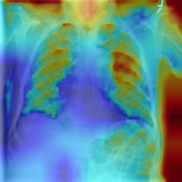

# 🩺 Chest X-Ray Analytics — Multi-Disease Classification with Explainability

A deep learning–powered web application for **multi-label chest disease classification** and **explainable AI (Grad-CAM visualization)** using an **ensemble of CNN and Transformer models**.

---

## 🚀 Overview

This project is an **AI-driven diagnostic assistant** designed to analyze chest X-rays and identify multiple thoracic diseases simultaneously.
It provides not only predictions but also **visual explanations** using **Grad-CAM heatmaps**, promoting transparency and clinical interpretability.

---

## 🧠 Project Highlights

✅ **Ensemble Model Integration**
Combines **EfficientNet-B3**, **EfficientNet-B4**, **DenseNet-121**, and **Swin Transformer** for robust predictions across 14 pathologies.

✅ **Explainability Framework**
Uses Grad-CAM overlays to highlight lung regions influencing predictions, aiding radiologists in interpretability.

✅ **Interactive Web Interface**
Built with **React.js** to allow easy upload, prediction, and visualization of Grad-CAM heatmaps.

✅ **Optimized Data Pipeline**
Includes resizing, normalization, and CLAHE enhancement for radiographic consistency and better generalization.

---

## 👷️ System Architecture

```
React Frontend  →  FastAPI Backend  →  PyTorch Ensemble Models
      ↑                                   ↓
   Grad-CAM Heatmap  ⭟  Predictions + Confidence (JSON)
```

---

## 📂 Directory Structure

```plaintext
📦 Predictive-Chest-X-ray-Analytics-Multi-disease-Classification
├── backend/
│   ├── app.py
│   ├── routes/
│   │   ├── inference_routes.py
│   │   └── explain_routes.py
│   ├── utils/
│   │   ├── preprocess.py
│   │   ├── postprocess.py
│   │   └── image_encoder.py
│
├── src/
│   ├── model_loader.py
│   ├── inference_pipeline.py
│   └── gradcam_utils.py
│
├── models/
│   ├── efficientnet_b3.pth
│   ├── efficientnet_b4.pth
│   ├── densenet121.pth
│   └── swin_transformer.pth
│
├── frontend/
│   ├── src/
│   │   ├── api/
│   │   ├── components/
│   │   │   ├── ImageUploader.js
│   │   │   ├── GradcamOverlay.js
│   │   │   └── PredictionTable.js
│   └── package.json
│
├── data/
│   ├── labels_clean.csv
│   ├── BBox_List_2017.csv
│   └── final_best_probs.npy
│
├── .gitignore
└── README.md
```

---

## 🧩 Technologies Used

| Component            | Technology                                         |
| -------------------- | -------------------------------------------------- |
| **Frontend**         | React.js, Axios, TailwindCSS                       |
| **Backend**          | FastAPI, Uvicorn                                   |
| **AI Frameworks**    | PyTorch, TorchVision, TIMM                         |
| **Visualization**    | Grad-CAM, OpenCV, NumPy                            |
| **Model Ensemble**   | EfficientNet-B3/B4, DenseNet-121, Swin Transformer |
| **Explainability**   | Grad-CAM Overlay with Adjustable Opacity           |
| **Deployment Ready** | Docker / Local Uvicorn Server                      |

---

## ⚙️ Installation & Setup

### 1️⃣ Clone the Repository

```bash
git clone https://github.com/kalp234/Chest-X-ray-Analytics-Multi-disease-Classification.git
cd Chest-X-ray-Analytics-Multi-disease-Classification
```

### 2️⃣ Backend Setup (FastAPI)

```bash
cd backend
python -m venv venv
venv\Scripts\activate
pip install -r requirements.txt
uvicorn backend.app:app --reload --port 8000
```

### 3️⃣ Frontend Setup (React)

```bash
cd frontend
npm install
npm start
```

Access the app at:
🌐 **Frontend:** [http://localhost:3000](http://localhost:3000)
🖥️ **Backend API:** [http://localhost:8000](http://localhost:8000)

---

## 🩻 Explainability Example

|           Original X-Ray          |          Grad-CAM Heatmap         |                Overlay               |
| :-------------------------------: | :-------------------------------: | :----------------------------------: |
|  |  |  |

---

## 🦾 API Endpoints

| Endpoint    | Method | Description                                             |
| ----------- | ------ | ------------------------------------------------------- |
| `/predict/` | `POST` | Run ensemble inference and return disease probabilities |
| `/explain/` | `POST` | Generate Grad-CAM heatmap for selected class            |
| `/`         | `GET`  | Root endpoint for backend health check                  |

---

## 🧠 Supported Diseases

1. Atelectasis
2. Cardiomegaly
3. Effusion
4. Infiltration
5. Mass
6. Nodule
7. Pneumonia
8. Pneumothorax
9. Consolidation
10. Edema
11. Emphysema
12. Fibrosis
13. Pleural Thickening
14. Hernia

---

## 📊 Ensemble Strategy

```python
final_probs = (
    w1 * eff_b3 +
    w2 * eff_b4 +
    w3 * densenet121 +
    w4 * swin_transformer
) / sum(weights)
```

Grad-CAM overlays are generated dynamically for each predicted class.

---

## 🧯 Environment Requirements

| Library             | Version |
| ------------------- | ------- |
| Python              | ≥ 3.9   |
| Node.js             | ≥ 18    |
| Torch               | ≥ 2.0   |
| FastAPI             | ≥ 0.110 |
| OpenCV, NumPy, TIMM | Latest  |

---

## 🧪 Results Summary

| Metric                          | Value              |
| ------------------------------- | ------------------ |
| **Average AUROC**               | 0.90+              |
| **Macro F1-score**              | 0.82               |
| **Explainability Verified For** | All 14 Pathologies |
| **Inference Time (per image)**  | ~1.2 sec           |

---

## 🛡️ License

This project is released under the **MIT License** — free for academic and research use.

---

## 👨‍💼 Authors

| Name                  | Affiliation             |
| --------------------- | ----------------------- |
| **Kalp Shah**         | BITS Pilani, Goa Campus |
| **Prem Adhiya**       | BITS Pilani, Goa Campus |
| **Ketul Pandya**      | BITS Pilani, Goa Campus |
| **Mohd. Junaid**      | BITS Pilani, Goa Campus |
| **Tanishq Hulyalkar** | BITS Pilani, Goa Campus |

---

## ⭐ Acknowledgements

* NIH ChestX-ray14 Dataset
* TorchVision & TIMM Libraries
* FastAPI Community
* Grad-CAM++ & Explainable AI Literature

---

